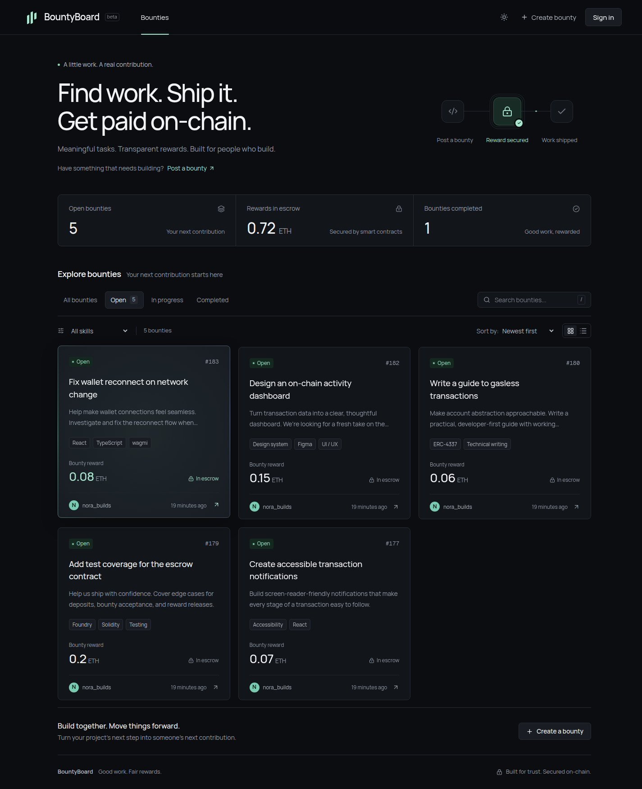
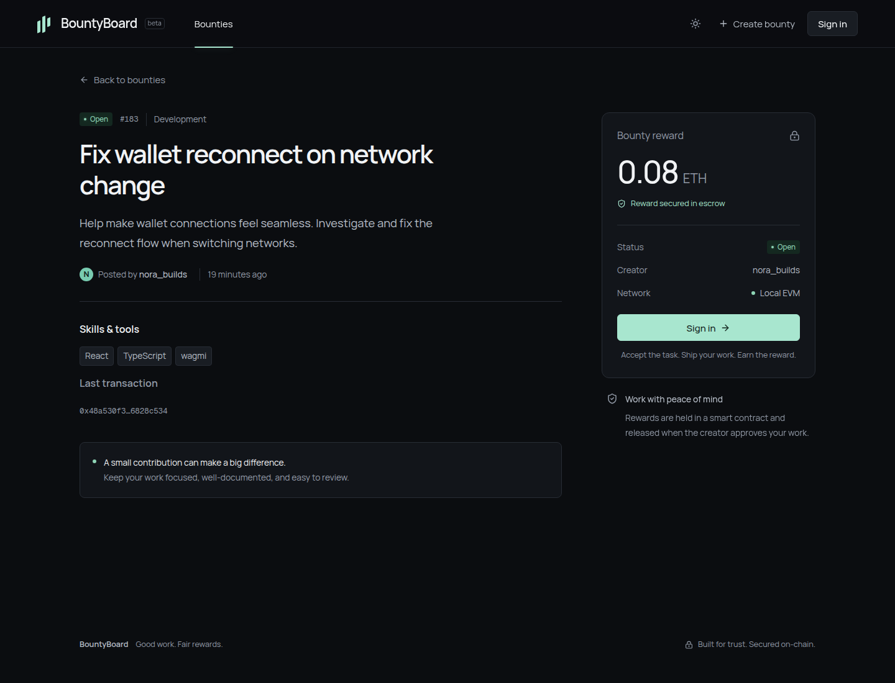
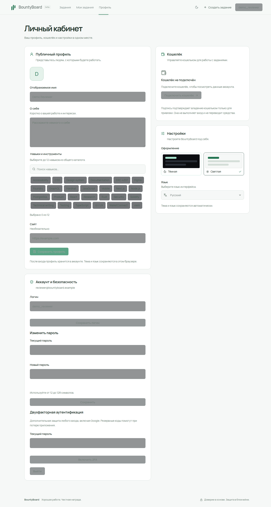
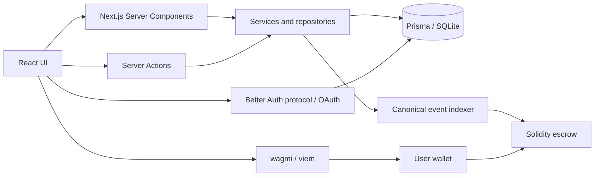

<div align="center">

# BountyFlow

**Good work. Fair rewards.**

A developer bounty marketplace with ETH escrow, a complete transaction lifecycle, and a carefully crafted multilingual interface.

[**Explore the interactive demo →**](https://arconw.github.io/BountyFlow/) · [Architecture](docs/architecture.md) · [Deployment](docs/deployment.md) · [Review & coverage](docs/review.md)

[](https://github.com/arconw/BountyFlow/actions/workflows/verify.yml)
[](https://github.com/arconw/BountyFlow/actions/workflows/pages.yml)
[](LICENSE)

Next.js 16 · React 19 · TypeScript · wagmi · viem · Solidity · Better Auth · Prisma · SQLite

</div>



## Try it

The [GitHub Pages demo](https://arconw.github.io/BountyFlow/) is a clearly labeled interactive simulation. Browse tasks, switch between creator and contributor, try the escrow flow, customize a profile, and change theme or language. State belongs to your browser and can be reset. **No wallet, real account, payment, or blockchain connection is used.**

`main` contains the full Next.js application: accounts and profiles persist in SQLite and escrow operations execute against an EVM contract. `demo` publishes the isolated static app in `demo/`, sharing visual components and design tokens. Pages cannot host the Node.js backend, database, or Server Actions.

The public demo demonstrates the product experience. A public Sepolia contract and hosted full backend still require deployment configuration; they are not represented as already deployed.

## Product

| Area         | Implemented behavior                                                                                                 |
| ------------ | -------------------------------------------------------------------------------------------------------------------- |
| Bounty board | Database-backed catalog, search, exact skill filters, sorting, animated grid/list views, personal tasks              |
| ETH escrow   | Create and fund → accept → creator approves and releases; cancel an unaccepted task for a refund                     |
| Wallets      | Injected/EIP-6963 wallets, optional WalletConnect, multiple signed wallet links, account/network switching           |
| Transactions | Simulation, pending/rejected/reverted states, reload recovery, replacement handling, canonical receipt indexing      |
| Accounts     | Verified email or Google registration, email/username login, optional password for Google accounts                   |
| Security     | Optional TOTP and one-time recovery codes, fresh-session checks, persistent attempt limits, protected server actions |
| Profiles     | Name, bio, website, shared curated skills, linked wallets; theme and language in profile settings                    |
| Localization | English, Russian, Spanish, Portuguese, French, German, Polish, Ukrainian; asynchronous dictionaries                  |
| Design       | Dark/light themes, Manrope, mint accents, animated borders, sliding navigation indicator, reduced-motion support     |

Wallets authorize blockchain operations and prove address ownership. **They never create an account or sign you in.** Public attribution uses usernames. Locale preference is stored locally and overrides browser-language detection.

<table>
<tr>
<td></td>
<td></td>
</tr>
</table>

## Run locally

Requires **Node.js 24**, npm, and available ports 3000/8545.

```bash
git clone https://github.com/arconw/BountyFlow.git
cd BountyFlow
npm ci
npm run dev:local
```

Open [localhost:3000](http://localhost:3000). The launcher starts a loopback-only local EVM, deploys the contract if needed, migrates SQLite, seeds related demo users and nine on-chain tasks, and starts Next.js. SQLite lives in `data/bountyflow.db`; existing data is retained. EVM state is in memory, so restarting it may require a new deployment; previous database history stays separate.

For a production build running locally:

```bash
npm run review:local
```

Create a local review account without an email service:

```bash
npm run account:local
```

This interactive command asks for your own credentials with hidden password input, requires loopback and chain 31337, and refuses to replace an existing account. No shared account password is shipped. Seed profiles have unknown random passwords.

For Google and mail delivery, see [config/environment.example](config/environment.example) and the [authentication guide](docs/authentication.md). Never commit a populated environment file. An absent service is visibly disabled in the interface.

## Architecture



Business reads run directly on the server. Mutations use validated, session-checked Server Actions. There is no duplicate CRUD REST layer. Only Better Auth's protocol and OAuth callbacks use `/api/auth/*`. Public catalog data uses the Next.js server cache; TanStack Query is reserved for wagmi. Private profiles and sessions never enter the shared catalog cache.

```text
src/app/                  Routes, server rendering, auth protocol
src/server/actions/       Authorized, validated mutations
src/server/services/      Business rules and blockchain indexing
src/server/repositories/  Prisma queries and relations
src/components/           Reusable UI by feature
src/hooks/                Interactive workflows
src/blockchain/           Wallet and transaction helpers
src/content/              Interface configuration and curated skills
src/styles/               Design tokens and feature styles
public/locales/           Eight asynchronous dictionaries
prisma/                   Models, migrations, local fixtures
contracts/                Solidity escrow
demo/                    Isolated static showcase
tests/                   Unit, integration, contract, browser tests
```

Users, credential providers, sessions, wallets, skills, bounties, deployments, and transactions have explicit relations, foreign keys, indexes, and unique constraints. See [architecture](docs/architecture.md), [style guide](docs/style-guide.md), and [design decisions](docs/design.md).

## Database and network

```bash
npm run db:generate
npm run db:deploy
npm run db:seed
```

Create development migrations with `npm run db:migrate -- --name change_name`. Production applies committed migrations with `db:deploy`; ORM models do not replace migration history. The curated skill catalog is provisioned by a data migration independently of demo seed data.

`config/network.json` contains public chain settings and the local contract address. `npm run chain:deploy:sepolia` supports deployment through a separately configured signer RPC; the application never requests private keys. Real-wallet testing, public deployment, and explorer verification remain manual release checks. [Deployment instructions →](docs/deployment.md)

## Verification

Keep `npm run chain:node` running in another terminal. On a fresh checkout:

```bash
npm run contract:compile
npm run db:deploy
npx playwright install chromium
npm run test:unit
npm run test:e2e
APP_ORIGIN=http://localhost:3000 npm run build
npm run typecheck
npm run demo:build
npm run demo:test
npm run format:check
npm audit
```

The browser suite creates a temporary SQLite database and a separate contract, then tests the actual Next.js app. A test EIP-1193 provider signs using the local node's disposable accounts. This exercises real wallet-link signatures and real escrow transfers; contract tests assert the exact payout. Application APIs and catalog responses are not mocked.

Auth tests cover verification, recovery, TOTP, recovery-code reuse, Google callback/state and 2FA enforcement, cross-origin rejection, session expiry, and forged-IP rate-limit attempts. Google exchange and mail delivery are substituted only in isolated tests. Static demo tests assert that no wallet provider or external RPC is contacted.

CI repeats verification on pushes and pull requests. The [review report](docs/review.md) records evidence, corrected defects, and external checks still needed.

## Publishing and production scope

Pages builds the `demo` branch. Preview the static artifact with `npm run demo:build` and verify it with `npm run demo:test`.

The full application needs a Node.js server, persistent SQLite volume, HTTPS, a trusted reverse proxy, stable auth material, configured mail/OAuth, and the correct RPC/contract. Ephemeral serverless filesystems are unsuitable for this database. [Deployment guide →](docs/deployment.md)

This is a working testnet application and portfolio showcase. The deliberately small escrow contract requires creator approval for accepted tasks and has no dispute or timeout withdrawal flow. It has regression coverage but no independent audit for real funds. [Security policy →](SECURITY.md)

## License

[ISC](LICENSE). Contributions are welcome; see [CONTRIBUTING](CONTRIBUTING.md).
