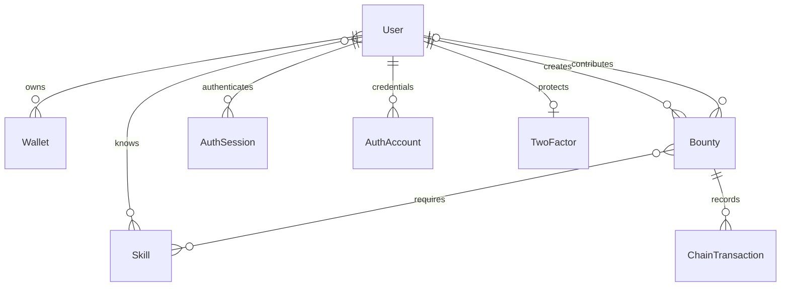

# Архитектура BountyBoard

## Серверные страницы и действия

Next.js выполняет роль frontend и backend. Server Components вызывают серверные функции чтения, сервисы и Prisma напрямую. `src/server/data` и функции получения текущего аккаунта помечены `server-only`. Подготовленные данные передаются интерактивным компонентам через RSC. Собственного CRUD API нет; `src/app/api/auth/[...all]` обслуживает протокол Better Auth и OAuth callbacks.

Server Actions в `src/server/actions` выполняют изменения профиля, привязку кошелька, установку первого пароля и подтверждение индексации транзакции. Каждое действие проверяет серверную сессию и входную схему. ID владельца определяется из сессии. Next проверяет origin Server Actions; размер запроса ограничен 32 КБ. На challenge, проверку подписи и подтверждение транзакции действуют лимиты по аккаунту. Ожидаемые ошибки возвращаются стабильными кодами без деталей ORM/RPC.

Сервисы создаются фабриками с зависимостями; тесты используют отдельную БД и verifier. Repository содержит повторяемые запросы со связями, без универсальной абстракции над Prisma.

## Кэш и обновление интерфейса

Публичный каталог и карточки кэшируются на сервере через `unstable_cache`: ключ включает сеть и контракт, общий тег — `bounties`, срок ревалидации — 15 секунд. После подтверждённой индексации, привязки кошелька или изменения аккаунта действия инвалидируют соответствующие данные и RSC маршруты. Сессия и приватный профиль не помещаются в общий кэш; React `cache` объединяет чтение сессии только в рамках серверного рендера.

Каталог и карточка обновляют RSC раз в 15 секунд, пока вкладка видима; при возврате фокуса обновляется текущий маршрут и сессия. Фильтры и анимации остаются клиентскими и сохраняют состояние при обновлении. Истёкший серверный кэш может сначала вернуть предыдущий результат и обновиться в фоне. Изменения через Server Actions инвалидируют данные немедленно. Ошибки серверной загрузки обрабатывает Next error boundary с повторной попыткой.

TanStack Query используется только для wagmi: баланс и состояние операций кошелька. Гидратации кэша бизнес-данных и дублирующих HTTP-запросов нет.

## Модели и связи

`Wallet.address` хранится нормализованным и уникален. Одна запись bounty в индексе идентифицируется комбинацией chain ID, адреса контракта deployment и on-chain ID; её DB ID используется в маршруте. Суммы ETH в DTO/БД — строки, суммы в контракте и вычисления выплат — bigint/wei. AuthSession связана только с User. AuthAccount хранит способы входа credential/Google. Прежняя Session сохранена для совместимости миграций, но больше не используется для входа. Удаление пользователя каскадно удаляет кошельки/сессии; исторические задания сохраняются с nullable-ссылками.

## Источник данных

Контракт — источник истины для автора, исполнителя, награды и статуса. Метаданные задания хранятся в JSON внутри контракта, поэтому создание не зависит от успешной отдельной записи формы в БД. Индексатор валидирует JSON через Zod, создаёт связи и обновляет SQLite. Невалидные сторонние metadata не рендерятся как HTML.

Синхронизация читает события по сохранённому курсору блоков, затем обновляет только затронутые задания на едином block number. Конкурентные запросы объединяются; обычное чтение обновляет индекс не чаще раза в 10 секунд. Подтверждение receipt запускает принудительное обновление. Обновления RSC используют серверный кэш и индексацию; при недоступности источника Next показывает состояние ошибки или ранее кэшированные данные.

Индексатор обрабатывает до пяти диапазонов по 2000 блоков за запрос и сохраняет прогресс в ChainDeployment. Ограничения по общему количеству bounty нет. Идентичность deployment включает hash блока развёртывания: перезапуск локальной цепочки не смешивается со старой SQLite-историей. При изменении hash ранее проиндексированного блока записи помечаются неканоническими и события перечитываются. Для большого публичного каталога стоит вынести обработку в фоновый worker и добавить серверную пагинацию; текущий UI обновляет частично догнанный индекс очередными запросами. SQLite-копия не является обещанием финализации сети.

ChainDeployment связан с заданиями и транзакциями; прежние deployments остаются в истории, но не показываются в текущем каталоге.

## Авторизация и привязка кошельков

Better Auth обслуживает регистрацию через подтверждённый email или Google, вход по email/логину и паролю, восстановление и добровольную TOTP. Factory `createAccountAuth` получает БД, настройки провайдера и адаптер почты. `accountFactor` распространяет стандартную проверку 2FA на OAuth callback. Прямой ID-token вход запрещён. До проверки второго фактора полноценной сессии нет. Установка первого пароля и изменения 2FA требуют входа не старше 15 минут.

`wallet-link-service` принимает только подтверждённый аккаунт. Одноразовый challenge связан с userId, адресом, origin и сроком действия. Подпись подтверждает привязку, но не создаёт пользователя или сессию. Уникальный адрес нельзя присвоить другому зарегистрированному аккаунту. Старые локальные записи без email можно привязать после подтверждения владения; история сохраняется.

Seed создаёт связанные демо-профили и кошельки из `prisma/fixtures`. Индексатор создаёт Bounty и ChainTransaction по реальным событиям локального контракта; клиент не подменяет эти записи статическими массивами. Индексатор больше не создаёт пользователей по событиям. Публичный DTO берёт username связанного аккаунта. Подробности настройки — в [документации авторизации](authentication.md).

Дата создания задания берётся из timestamp блока `BountyCreated`; последующие действия её не меняют. Успешное подтверждение опирается на канонический индекс, поэтому устаревший receipt не восстанавливает удалённую реорганизацией транзакцию. Hash границы блока проверяется до и после индексации, чтобы обнаружить смену цепочки во время RPC-чтений.

## Общий каталог навыков

`src/content/skills.ts` задаёт допустимые названия навыков. Миграция добавляет их в `Skill` независимо от демонстрационного seed. Профиль и форма bounty используют общий `SkillPicker`; серверная схема проверяет выбор, нормализует регистр и убирает дубликаты. Профиль хранит массив навыков и реальные many-to-many связи. Фильтр каталога сопоставляет конкретные навыки, а не категории задания.

## Публичное демо

Отдельное приложение `demo/` собирается Next.js в статический export. Оно использует общие визуальные компоненты и CSS, но имеет собственное демонстрационное состояние и fixtures. Плашка явно указывает на симуляцию. Основной runtime авторизации, Server Actions, Prisma и wallet connectors в демо не используются. Ветка `demo` публикует только этот export в Pages.

## Транзакции

Один глобальный TransactionProvider обслуживает все действия. До отправки выполняется simulateContract, проверяется текущий аккаунт/сеть. Отправка выполняется кошельком через wagmi. Hash сохраняется локально вместе с сетью и контрактом для возобновления ожидания после перезагрузки. Подтверждение в сети и обновление индекса — разные этапы: ошибка синхронизации не предлагает отправлять платёж ещё раз.

Контракт запрещает принимать собственное задание, повторно принимать занятое, выплачивать неавтору или повторно выплачивать завершённое. Отмена доступна автору только до принятия. Выплата использует смену состояния перед внешним вызовом и защиту от повторного входа.

## Настройки и локализация

Zustand хранит только явный выбор языка. Профиль хранится в БД. next-themes хранит тему отдельно. next-intl получает единственный асинхронно загруженный JSON из `public/locales`. Словари кэшируются загрузчиком по локали и защищены от завершения запросов в неправильном порядке. Данные задач и введённый пользователем текст не переводятся.

Редактор профиля доступен после входа и сохраняет серверный профиль аккаунта. Несохранённый черновик формы живёт только в памяти вкладки; серверные обновления автоматически применяются к форме без правок. Предпочтения языка и темы пока остаются исключительно в localStorage, как запрошено.
