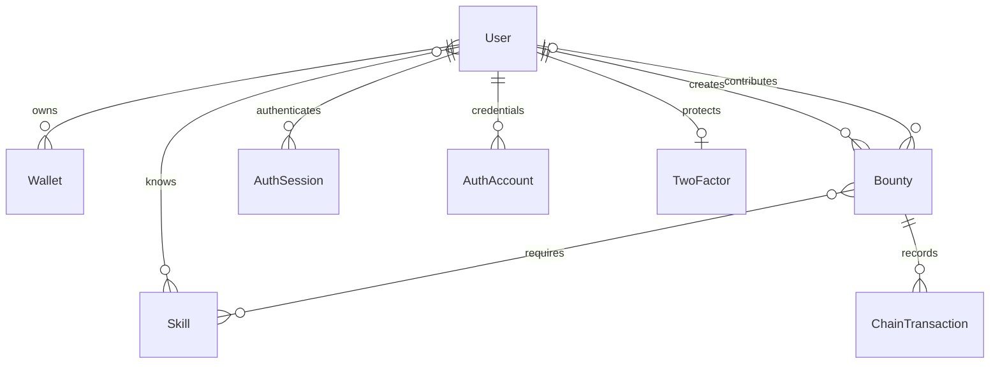

# BountyFlow architecture

## Server pages and actions

Next.js serves both the frontend and backend. Server Components call server data functions, services, and Prisma directly. `src/server/data` and current-account functions use `server-only`. Prepared data reaches interactive components through RSC. There is no separate CRUD API; `src/app/api/auth/[...all]` handles the Better Auth protocol and OAuth callbacks.

Server Actions in `src/server/actions` update profiles, link wallets, set an initial password, and confirm transaction indexing. Each action checks the server session and input schema. The owner ID comes from the session. Next.js validates the origin of Server Actions, and request bodies are limited to 32 KB. Challenges, signature verification, and transaction confirmation have per-account limits. Expected failures return stable error codes without ORM or RPC internals.

Services are created by factories with explicit dependencies; tests supply an isolated database and verifier. Repositories collect reusable relational queries without adding a generic abstraction over Prisma.

## Caching and interface updates

The public catalog and bounty details use server-side `unstable_cache`. Cache keys include the network and contract, share the `bounties` tag, and revalidate after 15 seconds. Confirmed indexing, wallet linking, and account changes invalidate the affected data and RSC routes. Sessions and private profiles never enter the shared cache; React `cache` deduplicates session reads within a server render only.

The board and details refresh RSC every 15 seconds while the tab is visible. Returning focus refreshes the current route and session. Filters and animations remain client-side and preserve their state during refresh. An expired server cache can return its previous value while updating in the background. Server Actions invalidate changed data immediately. A Next.js error boundary handles server-loading failures and offers a retry.

TanStack Query serves wagmi wallet balances and operation state. Business data uses server reads without a second client cache or duplicate HTTP requests.

## Models and relations

`Wallet.address` is normalized and unique. An indexed bounty is identified by its chain ID, deployment contract address, and on-chain ID; its database ID is used in routes. ETH amounts in DTOs and the database are strings. The contract and payout calculations use bigint values in wei. `AuthSession` belongs only to `User`. `AuthAccount` stores credential and Google sign-in methods. The legacy `Session` model remains for migration compatibility but is no longer used for sign-in. Deleting a user cascades to wallets and sessions; historical bounties remain with nullable user references.

## Source of truth

The contract is authoritative for the creator, contributor, reward, and status. Bounty metadata is stored as JSON in the contract, so creation does not depend on a separate successful form write to the database. The indexer validates JSON with Zod, creates relations, and updates SQLite. Untrusted metadata is never rendered as HTML.

Synchronization reads events from a saved block cursor, then refreshes only affected bounties at one consistent block number. Concurrent requests are coalesced; ordinary reads refresh the index at most once every 10 seconds. Receipt confirmation forces a refresh. RSC updates use server caching and indexing; an unavailable source results in the Next.js error state or previously cached data.

The indexer processes up to five ranges of 2,000 blocks per request and saves progress in `ChainDeployment`. There is no fixed total bounty limit. Deployment identity includes the deployment block hash, so a restarted local chain does not mix with older SQLite history. If a previously indexed block hash changes, records become noncanonical and events are replayed. A large public catalog should use a background worker and server pagination; the current UI advances a partially caught-up index through subsequent requests. The SQLite copy does not imply network finality.

`ChainDeployment` relates to bounties and transactions. Previous deployments remain in history but are excluded from the active catalog.

## Authentication and wallet linking

Better Auth handles verified-email or Google registration, email/username and password sign-in, recovery, and optional TOTP. The `createAccountAuth` factory receives the database, provider configuration, and mail adapter. `accountFactor` extends standard 2FA verification to the OAuth callback. Direct ID-token sign-in is disabled. A full session is unavailable until the second factor passes. Initial password setup and 2FA changes require authentication within the last 15 minutes.

`wallet-link-service` requires a verified account. A single-use challenge is bound to the user ID, address, origin, and expiry. A signature confirms the link without creating a user or session. A unique address cannot be reassigned to another registered account. Older local records without email can be linked after ownership verification while preserving history.

Seeding creates related demo profiles and wallets from `prisma/fixtures`. The indexer creates `Bounty` and `ChainTransaction` records from actual local-contract events; the client reads those records. The indexer does not create users from events. Public DTOs use the linked account's username. See [authentication](authentication.md) for configuration details.

A bounty's creation time comes from the `BountyCreated` block timestamp and remains unchanged by later actions. Successful confirmation depends on the canonical index, so a stale receipt cannot restore a transaction removed by a reorganization. The boundary block hash is checked before and after indexing to detect a chain change during RPC reads.

## Shared skill catalog

`src/content/skills.ts` defines allowed skill names. A migration provisions `Skill` rows independently of demo seeding. Profiles and bounty forms share `SkillPicker`; server schemas validate selections, normalize case, and remove duplicates. Profiles retain a skill array and actual many-to-many relations. Catalog filters match specific skills rather than bounty categories.

## Public demo

The separate `demo/` Next.js application builds a static export. It shares visual components and CSS while keeping its own simulated state and fixtures. A banner identifies the simulation. The demo excludes the main authentication runtime, Server Actions, Prisma, and wallet connectors. The `demo` branch publishes only this export to Pages.

## Transactions

One global `TransactionProvider` serves all actions. Before submission, `simulateContract` runs and the current account and network are checked. The wallet submits through wagmi. The transaction hash is saved locally with its network and contract so receipt tracking can resume after a reload. Network confirmation and index synchronization are separate stages: a synchronization error does not ask the user to send the payment again.

The contract rejects accepting one's own bounty, accepting an already assigned bounty, payouts by anyone other than the creator, and repeat payouts for completed tasks. Only the creator can cancel a bounty, and only before acceptance. Payouts update state before the external call and include reentrancy protection.

## Preferences and localization

Zustand stores only an explicit language choice. Profiles live in the database. next-themes stores the theme separately. next-intl receives one asynchronously loaded JSON dictionary from `public/locales`. The loader caches dictionaries by locale and protects against requests completing out of order. Bounty content and user-entered text are not translated.

The profile editor requires sign-in and saves the account's server-side profile. Unsaved drafts exist only in tab memory; server updates automatically refresh an unedited form. Language and theme preferences currently persist only in localStorage.
